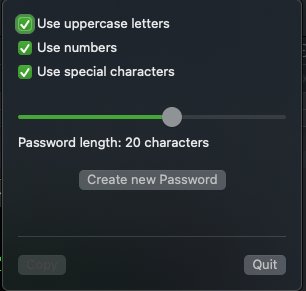
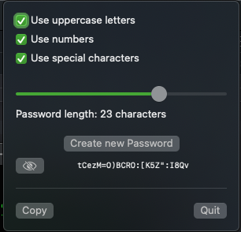

# PassMaker MacOS StatusMenu app

simply archive or build for production and add to your applications. 

Specify the length (default 8 characters)  
By default it will include lower, and uppercase letters along with numbers and special characters.

Min length is set to 4 chars, and max is 32.

By default the generated password is hidden, but can be shown.
Copy to paste it anywhere you like.

The app will retain the last password generated while active. Starting the application new will not allow you to get a history.

